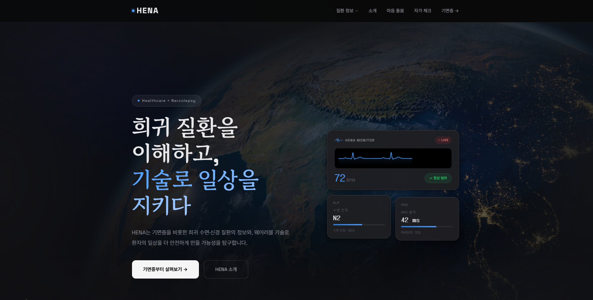
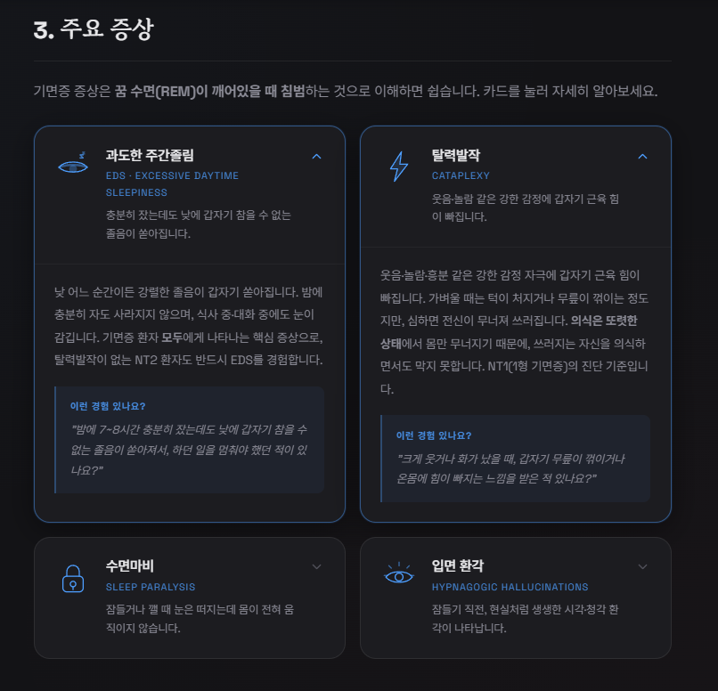
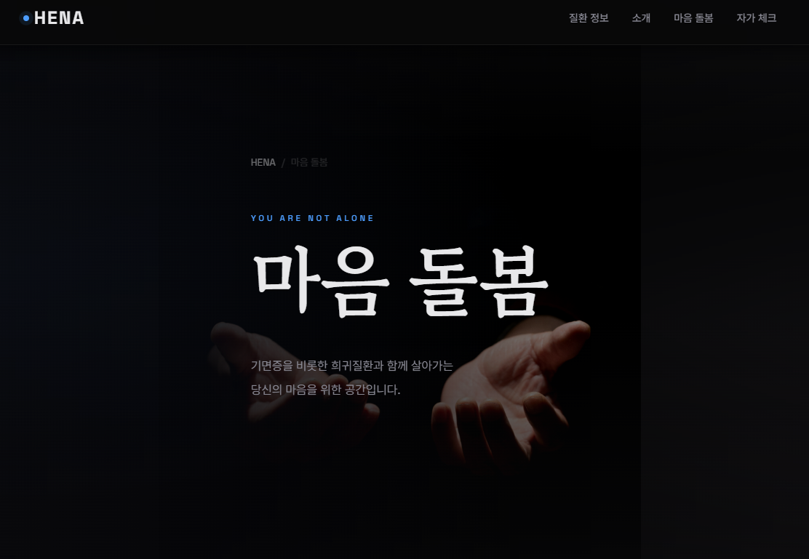
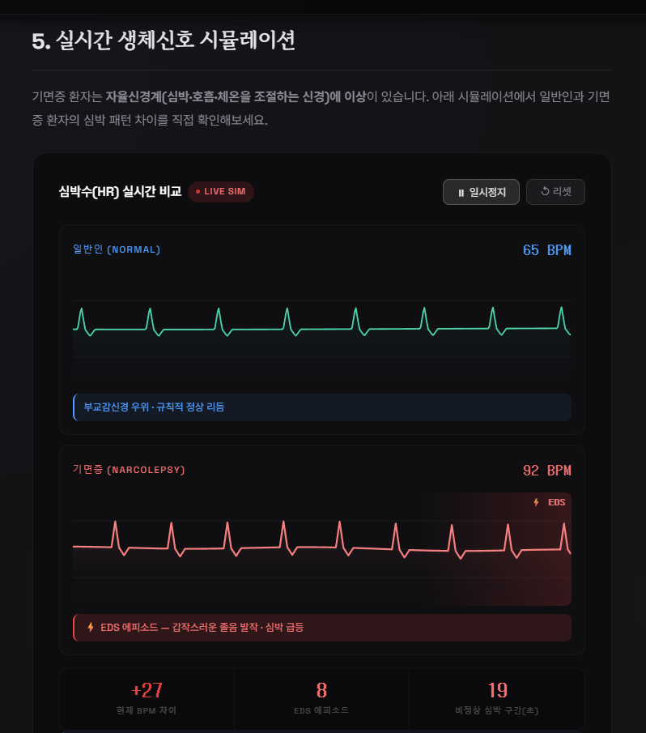
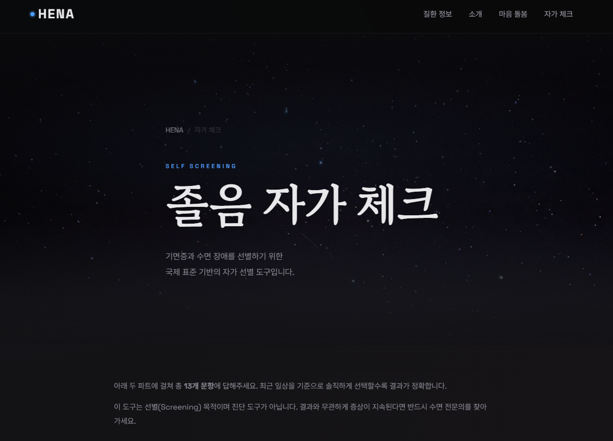

# HENA

웨어러블 기반 기면증 스크리닝 & 희귀 수면질환 정보 포털
Wearable-based narcolepsy screening & rare sleep disorder portal

---

Live → https://hcu1116.github.io/hena/

---



## 프로젝트 소개 (Overview)

웨어러블 기기로 측정한 심박수(HR)와 심박변이도(HRV)에서 기면증의 자율신경계 이상 패턴을
감지할 수 있는지 탐구하는 프로젝트입니다. PhysioNet 공개 수면 데이터를 바탕으로 ML 모델을
직접 구현하고, 결과를 인터랙티브 웹으로 시각화했습니다.

▸ 의료 진단이 아닌 스크리닝 보조 목적이며, 이상 소견 발견 시 전문의 상담을 권유합니다.

## 핵심 기능 (Features)

▸ 작동 원리 시각화 — 오렉신 결핍 → 자율신경 이상 → HRV 변화 경로를 인포그래픽으로 설명
▸ 실시간 생체신호 시뮬레이션 — 일반인 vs 기면증 HRV 파형을 브라우저에서 직접 비교
▸ 실제 데이터 분석 — PhysioNet 웨어러블 수면 데이터 기반 ML 파이프라인 구현
▸ 마음 돌봄 — 기면증 동반 정신건강 문제(우울·불안)에 대한 정보 공간 제공





## 기술 스택 (Tech Stack)

Frontend: HTML · CSS · JavaScript (Vanilla)
Data/ML: Python · pandas · scikit-learn
Deployment: GitHub Pages · GitHub Actions

## 데이터 분석 (ML Analysis)

PhysioNet sleep-accel 데이터셋(7명)으로 RandomForest 기반 수면단계 예측 모델을 구현했습니다.
단일 피험자 랜덤 분리 기준 68.9%, Leave-One-Out 교차검증(진짜 일반화 성능) 기준 평균 40.9%.
HRV 피처(RMSSD·SDNN·pNN50) 추가 시 42.8%로 소폭 개선됨을 확인했습니다.



한계: 웨어러블 HRV는 임상 PSG 수준의 HRV와 다르며, 7명 소규모 데이터라 일반화에 한계가 있습니다.
상세 코드 및 분석 과정은 `learning/06_realdata` 참고.



## 프로젝트 구조 (Structure)

```text
hena/
├── src/web/              # 홈페이지 (HTML/CSS/JS)
│   ├── index.html
│   ├── diseases/         # 질환 정보 페이지
│   └── mental-care.html  # 마음 돌봄 페이지
├── learning/             # Python 학습 + ML 실험
│   └── 06_realdata/      # PhysioNet 실데이터 ML 실험
├── 01_research/          # 의학 문헌 정리
│   └── medical/          # 기면증·정신건강 기초 정리
├── docs/screenshots/     # README용 스크린샷
└── .github/workflows/    # GitHub Pages 자동 배포
```

## License

MIT
